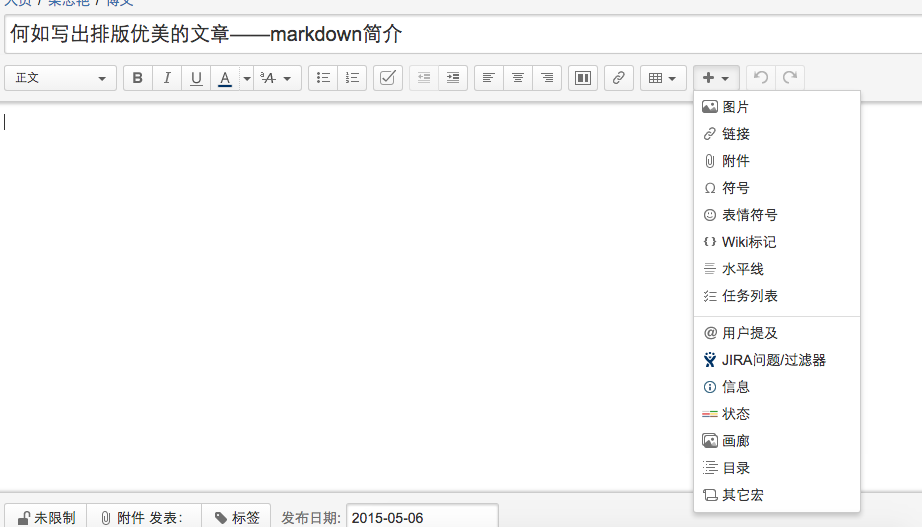
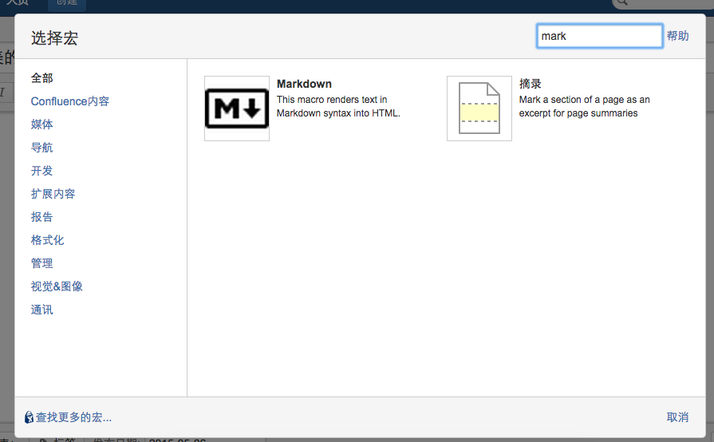
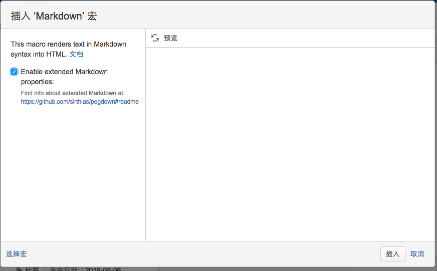
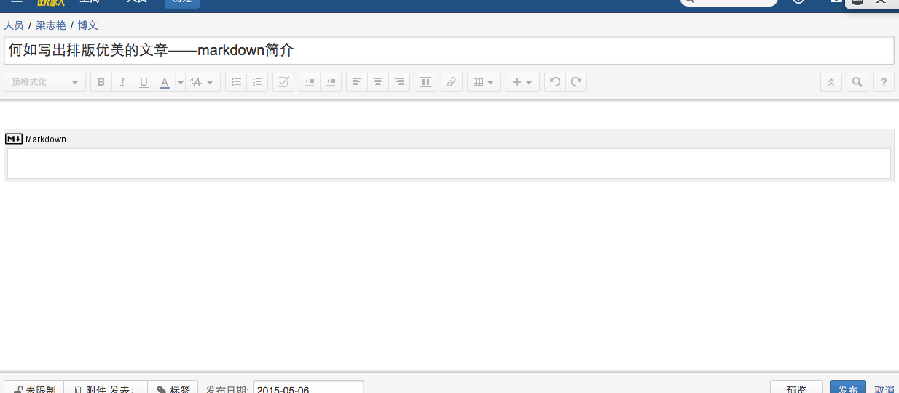

##何如写出排版优美的文章——markdown简介
作者：梁志艳  
email：liangzhiyan@kyee.com.cn
##为何要写这篇文章
最近公司终于开通了自己的wiki，真的是一大喜事。终于可以在上面愉快的写自己的技术博客了。但是试用过几篇文章后，发现体验并不是很好。因为写文章的过程中花很多的时间在调整文章格式上面，往往格式调好了，文章也没有写下去的动力了。

之前在github上面看很多的开源项目的文档，发现一个他们大多数是md文件。他们都有一个共同的特点：格式整洁美观。于是想一探究竟，google之后发现md文件原来是一种叫做**markdown**的文件。

越学习，越喜欢这个技术。实在是太方便了，写文章的时候双手不离开键盘就可以通知格式，而不是要先通过鼠标选择然后更改格式。Mac上面还有很多很强大的工具如Mou，写好文章之后可以生成html页面或者pdf文本。从此终于可以专注于文章内容了。

##什么是markdown
什么是markdown呢？官方是这么介绍的：
>Markdown is a text-to-HTML conversion tool for web writers. Markdown allows you to write using an easy-to-read, easy-to-write plain text format, then convert it to structurally valid XHTML (or HTML).

简单来说markdown就是一个转换工具，这个转换工具的作用就是把文本快速转化成html页面。一般的markdown工具都自带一套样式（主题），所以你只需要通过文本文件定义哪一行是标题，哪一些文字是段落，哪一些文字是代码……，markdown就会自动转换成整洁的html文本了。从这个角度看markdown是一种生成html的标记语言。

##如何使用markdown
首先需要一个支持markdown的文本编辑工具。

* Windows: [markdownpad](http://markdownpad.com/)
* Mac: [mou](http://25.io/mou/)
* Linux: [ReText](http://sourceforge.net/p/retext/home/ReText/)

markdown的语法很简单，大家自学大概30分钟就可以上手。具体可以查看官方文档：

[传送门:http://wowubuntu.com/markdown/](http://wowubuntu.com/markdown/)

另外还有一篇小清新的文档

[献给写作者的 Markdown 新手指南](http://www.jianshu.com/p/q81RER)

这些文档写的很好，本着不重新发明轮子的原则，这里我就不啰嗦语法了。

##confluence集成
最后不要忘记，我们最初的目的是为了写wiki，那么markdown怎么用在公司的wiki中呢？
###step 1:插入宏
点击工具栏右侧加号，选择**其他宏**。

右上方输入框中输入**markdown**，就会出现markdown宏。

点击弹出下面界面，点击确定就会插入宏。

###step 2:编辑markdown文本
这时界面显示如图，你就可以在宏中输入markdown文本了。

