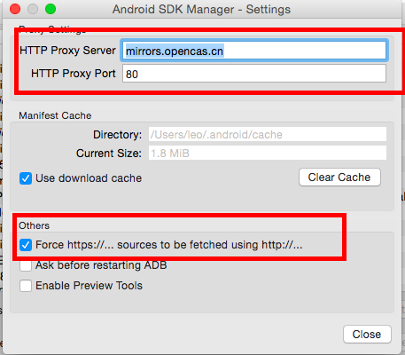

##使用镜像解决Android sdk更新内容慢的问题
###前言
在国内由于伟大的墙的原因，如果我们要安装Android sdk环境或者更新sdk中的资源，就不得不忍受龟速网络，而且随时有下载到99%就断掉的悲剧发生。

幸运的是这个世界总是好人多，国内有个开发者自己做了一个网站搜集了一下Android开发常用的资源，让我们可以下载。传送门[http://www.androiddevtools.cn/](http://www.androiddevtools.cn/)

这篇文章说明如果通过配置http 代理的方式加快sdk更新速度。
###流程
在配置好Android sdk环境后输入：

    android

弹出下图：    

选择菜单Tools->Options(Mac 10.10中是Preferences）,弹出下图：

输入代理地址和端口，并且把Force https选项勾上就行了。
###Android SDK在线更新镜像服务器
* 中国科学院开源协会镜像站地址:

>IPV4/IPV6: http://mirrors.opencas.cn 端口：80

>IPV4/IPV6: http://mirrors.opencas.org 端口：80

>IPV4/IPV6: http://mirrors.opencas.ac.cn 端口：80

* 上海GDG镜像服务器地址:

>http://sdk.gdgshanghai.com 端口：8000

* 北京化工大学镜像服务器地址:

>IPv4: http://ubuntu.buct.edu.cn/ 端口：80

>IPv4: http://ubuntu.buct.cn/ 端口：80

>IPv6: http://ubuntu.buct6.edu.cn/ 端口：80

* 大连东软信息学院镜像服务器地址:

>http://mirrors.neusoft.edu.cn 端口：80
